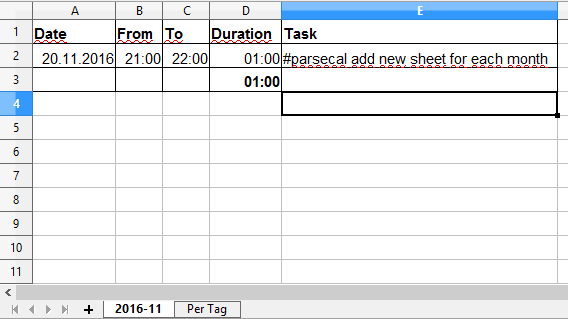
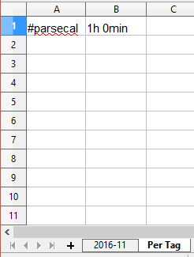
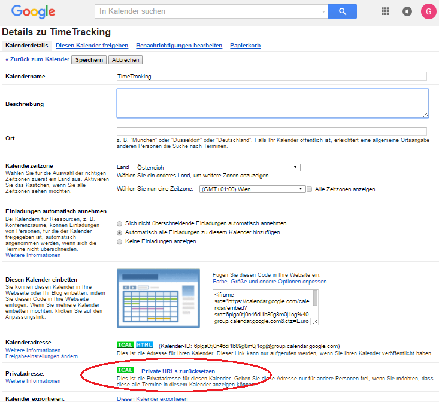

# PARSECAL

A simple ruby script to read and parse data from a **google calendar** (or other iCal calendars) and create an **Excel Timesheet**. It can be used to get an overview of how much time was spent on different activities, for documentation of working hours or for freelancers as basis for invoices.

## Results

The script will create a spreadsheet document with a time sheet for each month that has calendar entries:

Additionally, an overview is created that shows how much time was spent on each task in total

## Prerequisites:
Set up a google calendar for your time tracking project and export the iCal URL. To do so, open the google calendar page, select "settings", "calendars" and select your calendar. On the calendars detail page, click the private iCal URL Button (see image below).

Set the variable "*google_cal_url*" in parsecal.rb to this iCal URL (line 10).

The script requires the [icalendar](http://icalendar.rubyforge.org/) gem:

    sudo gem install icalendar

Also [axlsx](https://github.com/randym/axlsx) spreadsheet library is required:

    sudo gem install axlsx

(make sure zlib1g-dev is installed on linux)

(The ["spreadsheet"](https://github.com/zdavatz/spreadsheet) gem turned out quite disappointing for this purpose. Formulas did not work and there was very little documentation)

## Applications and Ideas for Further Development

- Automatic execution as cron-job
- As basis for a microservice
- Backend Service for a simple App
- Integration with E-Mail, Cloud Storage etc.
